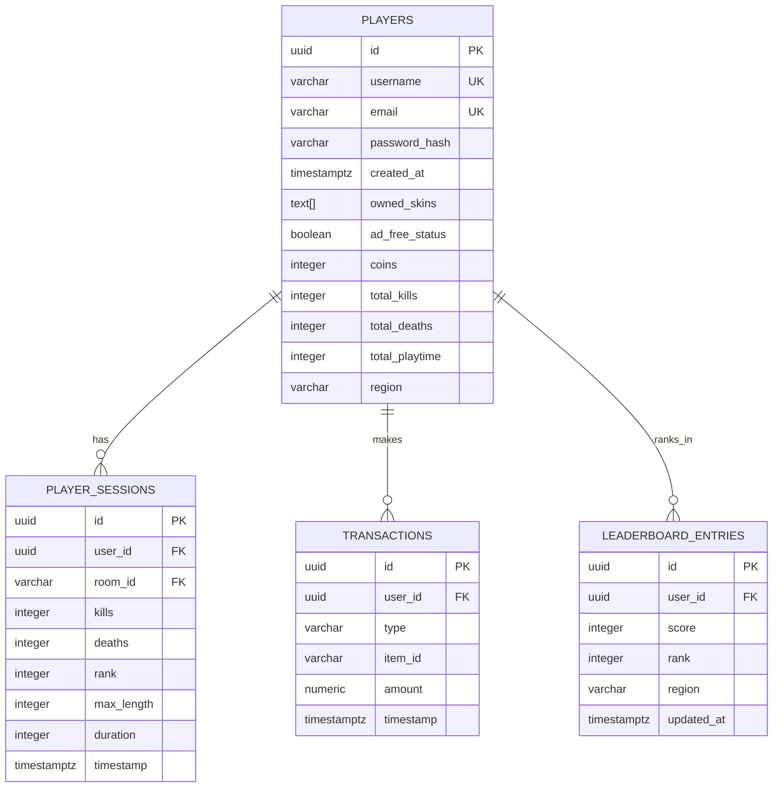

# Database Detailed Design

**Project:** Multiplayer Snake Game (Slither.io Clone)
**Version:** 1.0
**Date:** 2026-02-10
**Database:** PostgreSQL 14+ (persistent data) + Redis 7+ (ephemeral game state)

---

## Document Control

| Version | Date | Author | Changes |
|---------|------|--------|---------|
| 1.0 | 2026-02-10 | Systems Architect | Initial database design from SRD entities |

---

## 1. ER Diagram



**Storage Strategy:**
- **PostgreSQL**: Persistent data (users, sessions, transactions, leaderboards)
- **Redis**: Ephemeral game state (rooms, snakes, food) - not in ER diagram

---

## 2. PostgreSQL Schema

### 2.1 Table: `players` (E-01)

**Purpose:** Store persistent user accounts and profile data

| Column | Type | Constraints | Default | Description |
|--------|------|-------------|---------|-------------|
| `id` | `uuid` | PRIMARY KEY | `gen_random_uuid()` | Unique player ID |
| `username` | `varchar(50)` | UNIQUE, NOT NULL | - | Display name (3-50 chars) |
| `email` | `varchar(255)` | UNIQUE, NOT NULL | - | Email for login/recovery |
| `password_hash` | `varchar(255)` | NOT NULL | - | bcrypt hash (cost 12) |
| `created_at` | `timestamptz` | NOT NULL | `now()` | Account creation timestamp |
| `owned_skins` | `text[]` | NOT NULL | `ARRAY['classic-blue']` | Array of owned skin IDs |
| `ad_free_status` | `boolean` | NOT NULL | `false` | True if purchased ad-free |
| `coins` | `integer` | NOT NULL, CHECK >= 0 | `0` | Virtual currency for rewards |
| `total_kills` | `integer` | NOT NULL, CHECK >= 0 | `0` | Lifetime kill count |
| `total_deaths` | `integer` | NOT NULL, CHECK >= 0 | `0` | Lifetime death count |
| `total_playtime` | `integer` | NOT NULL, CHECK >= 0 | `0` | Lifetime playtime (seconds) |
| `region` | `varchar(10)` | NOT NULL | `'global'` | Region code (global, NA, EU, Asia) |
| `updated_at` | `timestamptz` | NOT NULL | `now()` | Last profile update |

**Indexes:**
```sql
CREATE UNIQUE INDEX idx_players_username ON players(username);
CREATE UNIQUE INDEX idx_players_email ON players(email);
CREATE INDEX idx_players_region ON players(region);
CREATE INDEX idx_players_created_at ON players(created_at DESC);
```

**Related FR:** FR-01 (account), FR-08 (ad-free), FR-09 (skins), FR-10 (premium), FR-11 (coins/rewards), FR-13 (stats), FR-15 (anti-cheat tracking)

---

### 2.2 Table: `player_sessions` (E-02)

**Purpose:** Record each game session for stats and history

| Column | Type | Constraints | Default | Description |
|--------|------|-------------|---------|-------------|
| `id` | `uuid` | PRIMARY KEY | `gen_random_uuid()` | Unique session ID |
| `user_id` | `uuid` | FOREIGN KEY → players(id), NOT NULL | - | Player who played session |
| `room_id` | `varchar(20)` | NOT NULL | - | Room identifier |
| `kills` | `integer` | NOT NULL, CHECK >= 0 | `0` | Kills in this session |
| `deaths` | `integer` | NOT NULL, CHECK >= 0 | `0` | Deaths (should be 1 max) |
| `rank` | `integer` | NOT NULL, CHECK >= 1 | - | Final rank in room |
| `max_length` | `integer` | NOT NULL, CHECK >= 1 | - | Longest snake length achieved |
| `duration` | `integer` | NOT NULL, CHECK >= 0 | - | Session duration (seconds) |
| `timestamp` | `timestamptz` | NOT NULL | `now()` | When session ended |

**Indexes:**
```sql
CREATE INDEX idx_player_sessions_user_id ON player_sessions(user_id);
CREATE INDEX idx_player_sessions_timestamp ON player_sessions(timestamp DESC);
CREATE INDEX idx_player_sessions_user_timestamp ON player_sessions(user_id, timestamp DESC);
```

**Related FR:** FR-06 (death screen stats), FR-13 (player profile stats)

**Triggers:**
```sql
-- Update player aggregate stats after session insert
CREATE OR REPLACE FUNCTION update_player_stats()
RETURNS TRIGGER AS $$
BEGIN
    UPDATE players
    SET
        total_kills = total_kills + NEW.kills,
        total_deaths = total_deaths + NEW.deaths,
        total_playtime = total_playtime + NEW.duration,
        updated_at = now()
    WHERE id = NEW.user_id;
    RETURN NEW;
END;
$$ LANGUAGE plpgsql;

CREATE TRIGGER trigger_update_player_stats
AFTER INSERT ON player_sessions
FOR EACH ROW
EXECUTE FUNCTION update_player_stats();
```

---

### 2.3 Table: `transactions` (E-07)

**Purpose:** Track all monetization events (purchases, ad views)

| Column | Type | Constraints | Default | Description |
|--------|------|-------------|---------|-------------|
| `id` | `uuid` | PRIMARY KEY | `gen_random_uuid()` | Unique transaction ID |
| `user_id` | `uuid` | FOREIGN KEY → players(id), NOT NULL | - | Player who made transaction |
| `type` | `varchar(20)` | NOT NULL, CHECK IN (...) | - | ad_view, skin_purchase, ad_free |
| `item_id` | `varchar(50)` | NULL | - | Skin ID or NULL (for ad-free) |
| `amount` | `numeric(10,2)` | NOT NULL, CHECK >= 0 | `0.00` | USD amount ($0 for ads) |
| `timestamp` | `timestamptz` | NOT NULL | `now()` | When transaction occurred |
| `metadata` | `jsonb` | NULL | - | Optional extra data (ad network, payment gateway) |

**Indexes:**
```sql
CREATE INDEX idx_transactions_user_id ON transactions(user_id);
CREATE INDEX idx_transactions_type ON transactions(type);
CREATE INDEX idx_transactions_timestamp ON transactions(timestamp DESC);
CREATE INDEX idx_transactions_user_type ON transactions(user_id, type);
```

**Check Constraint:**
```sql
ALTER TABLE transactions
ADD CONSTRAINT chk_transaction_type
CHECK (type IN ('ad_view', 'skin_purchase', 'ad_free'));
```

**Related FR:** FR-08 (ad views), FR-09 (skin purchases), FR-10 (ad-free purchase)

---

### 2.4 Table: `leaderboard_entries` (E-06)

**Purpose:** Cache leaderboard rankings for fast queries

| Column | Type | Constraints | Default | Description |
|--------|------|-------------|---------|-------------|
| `id` | `uuid` | PRIMARY KEY | `gen_random_uuid()` | Unique entry ID |
| `user_id` | `uuid` | FOREIGN KEY → players(id), NOT NULL | - | Player being ranked |
| `score` | `integer` | NOT NULL, CHECK >= 0 | - | Player's current score |
| `rank` | `integer` | NOT NULL, CHECK >= 1 | - | Player's current rank |
| `region` | `varchar(10)` | NOT NULL | - | Region scope (global, NA, EU, Asia) |
| `updated_at` | `timestamptz` | NOT NULL | `now()` | When ranking was updated |

**Indexes:**
```sql
CREATE INDEX idx_leaderboard_region_rank ON leaderboard_entries(region, rank);
CREATE INDEX idx_leaderboard_user_region ON leaderboard_entries(user_id, region);
CREATE UNIQUE INDEX idx_leaderboard_user_region_unique ON leaderboard_entries(user_id, region);
```

**Related FR:** FR-05 (in-game leaderboard), FR-12 (regional leaderboards)

**Note:** This table is periodically synced from Redis cache (where real-time rankings live). Update frequency: every 5 minutes.

---

## 3. Redis Schema (Ephemeral Game State)

### 3.1 Key Pattern: `room:{room_id}` (E-05)

**Purpose:** Store active game room state

**Data Type:** Hash

**Fields:**
| Field | Type | Description |
|-------|------|-------------|
| `room_id` | string | Unique room identifier (UUID v4) |
| `status` | string | active, full, closing |
| `max_players` | integer | 50 (hardcoded limit) |
| `player_count` | integer | Current number of players |
| `players` | JSON array | Array of user_ids in room |
| `created_at` | timestamp | Room creation time |

**TTL:** 30 minutes (auto-delete inactive rooms)

**Related FR:** FR-01 (room matchmaking), FR-14 (spectator mode)

**Example:**
```redis
HSET room:a1b2c3d4-e5f6 status "active"
HSET room:a1b2c3d4-e5f6 max_players 50
HSET room:a1b2c3d4-e5f6 player_count 23
HSET room:a1b2c3d4-e5f6 players '["user-id-1", "user-id-2", ...]'
EXPIRE room:a1b2c3d4-e5f6 1800
```

---

### 3.2 Key Pattern: `snake:{user_id}:{room_id}` (E-03)

**Purpose:** Store real-time snake state during gameplay

**Data Type:** Hash

**Fields:**
| Field | Type | Description |
|-------|------|-------------|
| `snake_id` | string | Unique snake ID (UUID v4) |
| `user_id` | string | Player UUID |
| `position` | JSON | `{x: 500, y: 300}` head position |
| `segments` | JSON array | Array of segment positions: `[{x, y}, ...]` |
| `length` | integer | Current snake length (1-1000) |
| `speed` | float | Current speed (base 2.5, boost 5.0) |
| `boost_active` | boolean | True if boosting |
| `direction` | float | Angle in radians (0-2π) |
| `alive` | boolean | True if alive, false if dead |
| `skin` | string | Equipped skin ID |

**TTL:** Matches room TTL (30 minutes)

**Related FR:** FR-02 (movement), FR-03 (growth), FR-04 (collision), FR-05 (leaderboard), FR-07 (interpolation), FR-14 (spectator)

**Example:**
```redis
HSET snake:user-123:room-abc position '{"x": 500, "y": 300}'
HSET snake:user-123:room-abc segments '[{"x":500,"y":300},{"x":490,"y":300},...]'
HSET snake:user-123:room-abc length 45
HSET snake:user-123:room-abc alive true
EXPIRE snake:user-123:room-abc 1800
```

---

### 3.3 Key Pattern: `food:{room_id}` (E-04)

**Purpose:** Store food locations for each room

**Data Type:** Set (of JSON strings)

**Members:** Each member is a JSON string: `{"id":"food-123","x":250,"y":150,"value":1,"color":"white"}`

**TTL:** Matches room TTL (30 minutes)

**Related FR:** FR-03 (food collection), FR-04 (collision with food)

**Example:**
```redis
SADD food:room-abc '{"id":"food-1","x":100,"y":200,"value":1,"color":"white"}'
SADD food:room-abc '{"id":"food-2","x":300,"y":400,"value":1,"color":"green"}'
# ... 500-800 food entities per room
EXPIRE food:room-abc 1800
```

---

### 3.4 Key Pattern: `leaderboard:{region}:{timestamp}` (Cache)

**Purpose:** Cache leaderboard rankings for fast queries

**Data Type:** Sorted Set

**Score:** Player's score (kills + max_length)
**Member:** User ID

**TTL:** 5 minutes (refreshed from PostgreSQL)

**Related FR:** FR-05 (real-time leaderboard), FR-12 (regional leaderboards)

**Example:**
```redis
ZADD leaderboard:global:1707567600 12451 "user-id-1"
ZADD leaderboard:global:1707567600 11987 "user-id-2"
ZADD leaderboard:NA:1707567600 9103 "user-id-3"
EXPIRE leaderboard:global:1707567600 300
```

---

## 4. Data Integrity Rules

### 4.1 Referential Integrity

**PostgreSQL Foreign Keys:**
- `player_sessions.user_id` → `players.id` (ON DELETE CASCADE)
- `transactions.user_id` → `players.id` (ON DELETE CASCADE)
- `leaderboard_entries.user_id` → `players.id` (ON DELETE CASCADE)

**Rationale:** If player account deleted, cascade delete all related data (GDPR compliance).

### 4.2 Data Validation

**Username:**
- Length: 3-50 characters
- Pattern: `^[a-zA-Z0-9_-]+$` (alphanumeric, underscore, hyphen only)
- Profanity filter: Server-side validation

**Email:**
- Pattern: RFC 5322 compliant
- Uniqueness enforced by unique index

**Password:**
- Minimum 8 characters (enforced at API layer)
- Stored as bcrypt hash (cost 12)
- Never stored in plaintext

**Owned Skins:**
- Default: `['classic-blue']`
- Valid IDs: Must match skin catalog (validated at API layer)

---

## 5. Indexing Strategy

### 5.1 Performance Targets

| Query Type | Target Latency | Index |
|------------|----------------|-------|
| User lookup by email | <5ms | `idx_players_email` (unique) |
| User lookup by username | <5ms | `idx_players_username` (unique) |
| Player session history | <10ms | `idx_player_sessions_user_timestamp` (composite) |
| Leaderboard top 100 | <10ms | Redis sorted set + `idx_leaderboard_region_rank` |
| Transaction history | <10ms | `idx_transactions_user_id` |

### 5.2 Composite Indexes

**Most Frequent Queries:**

1. **Get player sessions (recent first):**
```sql
SELECT * FROM player_sessions
WHERE user_id = $1
ORDER BY timestamp DESC
LIMIT 20;
-- Uses: idx_player_sessions_user_timestamp
```

2. **Get leaderboard by region:**
```sql
SELECT * FROM leaderboard_entries
WHERE region = $1
ORDER BY rank ASC
LIMIT 100;
-- Uses: idx_leaderboard_region_rank
```

3. **Get user transactions by type:**
```sql
SELECT * FROM transactions
WHERE user_id = $1 AND type = $2
ORDER BY timestamp DESC;
-- Uses: idx_transactions_user_type
```

---

## 6. Data Migration Strategy

### 6.1 Initial Schema Setup

**Order of Execution:**
1. Create `players` table
2. Create `player_sessions` table
3. Create `transactions` table
4. Create `leaderboard_entries` table
5. Create indexes
6. Create triggers

**Migration File:** `migrations/001_initial_schema.sql`

### 6.2 Seed Data (Development)

**Test Users:**
```sql
INSERT INTO players (username, email, password_hash, owned_skins, total_kills, total_deaths)
VALUES
  ('TestPlayer1', 'test1@example.com', '$2a$12$...', ARRAY['classic-blue', 'mint-green'], 150, 45),
  ('ProGamer42', 'pro@example.com', '$2a$12$...', ARRAY['classic-blue', 'golden-emperor'], 523, 89);
```

**Seed File:** `seeds/dev_users.sql`

---

## 7. Backup & Recovery

### 7.1 PostgreSQL Backups

**Strategy:** Daily full backup + continuous WAL archiving

**Schedule:**
- Full backup: 2 AM UTC daily
- Retention: 30 days
- Storage: AWS S3 or DigitalOcean Spaces

**Tools:**
- `pg_dump` for full backups
- `pg_basebackup` + WAL archiving for point-in-time recovery

### 7.2 Redis Persistence

**Strategy:** RDB snapshots + AOF (Append-Only File)

**Configuration:**
```redis
# RDB: Snapshot every 5 minutes if ≥100 keys changed
save 300 100

# AOF: fsync every second
appendonly yes
appendfsync everysec
```

**Rationale:** Game state is ephemeral (rooms expire after 30 min), but persist to recover from crashes.

---

## 8. Scalability Considerations

### 8.1 Horizontal Scaling

**PostgreSQL:**
- **Read replicas** for leaderboard queries (Phase 2)
- **Connection pooling** via PgBouncer (max 100 connections/pool)
- **Partitioning** player_sessions by timestamp (monthly partitions) when >10M rows

**Redis:**
- **Redis Cluster** for horizontal scaling (Phase 3)
- **Sharding by room_id** to distribute load
- Current single-instance limit: ~10k rooms (500k CCU)

### 8.2 Caching Strategy

**Two-Tier Cache:**
1. **Redis (L1):** Real-time game state (snakes, rooms, food)
2. **PostgreSQL (L2):** Persistent data with Redis cache layer

**Cache Invalidation:**
- Leaderboard cache: TTL 5 minutes
- Player profile cache: TTL 1 hour, invalidated on update

---

## 9. Security Measures

### 9.1 SQL Injection Prevention

**Parameterized Queries:**
```javascript
// ✅ SAFE: Parameterized query
db.query('SELECT * FROM players WHERE email = $1', [email]);

// ❌ UNSAFE: String concatenation
db.query(`SELECT * FROM players WHERE email = '${email}'`);
```

**ORM Usage:** Use Sequelize or TypeORM with built-in escaping.

### 9.2 Sensitive Data Protection

**Password Storage:**
- Never store plaintext
- bcrypt with cost 12 (2^12 iterations)
- Salted automatically by bcrypt

**PII Encryption:**
- Email addresses: plain (needed for login)
- Payment data: Never stored (handled by Stripe/PayPal)

### 9.3 Access Control

**Database User Roles:**
- `app_read`: SELECT only (for read replicas)
- `app_write`: SELECT, INSERT, UPDATE (for game server)
- `app_admin`: Full access (for migrations, maintenance)

---

## 10. Monitoring & Alerts

### 10.1 PostgreSQL Metrics

**Monitor:**
- Query latency (p50, p95, p99)
- Connection pool utilization
- Slow queries (>100ms)
- Disk usage (alert at >80%)
- Replication lag (read replicas)

**Tools:** pgAdmin, Datadog, New Relic

### 10.2 Redis Metrics

**Monitor:**
- Memory usage (alert at >80% of max)
- Eviction rate (should be 0 for game state)
- Command latency (p99 <1ms)
- Key expiration rate

**Tools:** Redis CLI (`INFO`), RedisInsight, Datadog

---

## 11. Data Retention Policy

| Data Type | Retention | Rationale |
|-----------|-----------|-----------|
| Player accounts | Indefinite (until user deletes) | Core data |
| Player sessions | 1 year | Historical stats, then archive |
| Transactions | 7 years | Legal requirement (financial records) |
| Leaderboard entries | 90 days | Historical rankings, then purge |
| Redis game state | 30 minutes TTL | Ephemeral, auto-expire |

**GDPR Compliance:**
- User can request account deletion → CASCADE DELETE all related data
- Data export: Provide JSON dump of user's data
- Retention policy documented in Privacy Policy

---

## 12. Traceability Matrix

| Entity | SRD Entity ID | PostgreSQL Table | Redis Key Pattern | Related FR |
|--------|---------------|------------------|-------------------|------------|
| Player | E-01 | `players` | - | FR-01, FR-08, FR-09, FR-10, FR-11, FR-13, FR-15 |
| PlayerSession | E-02 | `player_sessions` | - | FR-06, FR-13 |
| Snake | E-03 | - | `snake:{user_id}:{room_id}` | FR-02, FR-03, FR-04, FR-05, FR-07, FR-14 |
| Food | E-04 | - | `food:{room_id}` | FR-03, FR-04 |
| Room | E-05 | - | `room:{room_id}` | FR-01, FR-14 |
| LeaderboardEntry | E-06 | `leaderboard_entries` | `leaderboard:{region}:{ts}` | FR-05, FR-12 |
| Transaction | E-07 | `transactions` | - | FR-08, FR-09, FR-10 |

---

## 13. Sample Queries

### 13.1 Get Player Profile
```sql
SELECT
    id, username, email, created_at, owned_skins, ad_free_status,
    coins, total_kills, total_deaths, total_playtime, region,
    CASE WHEN total_deaths > 0
         THEN ROUND(total_kills::numeric / total_deaths, 2)
         ELSE total_kills::numeric
    END as kd_ratio
FROM players
WHERE id = $1;
```

### 13.2 Get Recent Sessions
```sql
SELECT
    id, kills, deaths, rank, max_length, duration, timestamp
FROM player_sessions
WHERE user_id = $1
ORDER BY timestamp DESC
LIMIT 20;
```

### 13.3 Get Leaderboard (Top 100, Region)
```sql
SELECT
    le.rank,
    p.username,
    le.score,
    CASE WHEN p.total_deaths > 0
         THEN ROUND(p.total_kills::numeric / p.total_deaths, 2)
         ELSE p.total_kills::numeric
    END as kd_ratio,
    p.ad_free_status
FROM leaderboard_entries le
JOIN players p ON le.user_id = p.id
WHERE le.region = $1
ORDER BY le.rank ASC
LIMIT 100;
```

### 13.4 Get Transaction History
```sql
SELECT
    id, type, item_id, amount, timestamp
FROM transactions
WHERE user_id = $1
ORDER BY timestamp DESC
LIMIT 50;
```

---

## 14. Next Steps

**After Database Design Approval:**
1. **Generate API_SPEC.md** → Define REST/WebSocket endpoints
2. **Create Migration Scripts** → `migrations/001_initial_schema.sql`
3. **Set Up Development Database** → Docker Compose with PostgreSQL + Redis
4. **Seed Test Data** → `seeds/dev_users.sql`
5. **Run `/plan`** → Generate implementation tasks for Phase 1

---

**End of Document**

**Status:** Ready for Review
**Next Command:** `/ipa:detail` (already running) → Will generate API_SPEC.md next
